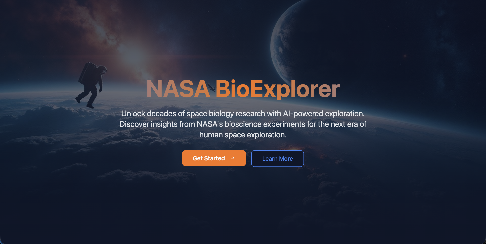
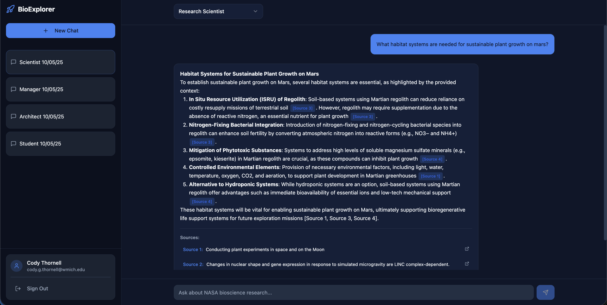

# Space Biology Knowledge Engine  
*A project for the 2025 NASA Space Apps Challenge — “Build a Space Biology Knowledge Engine”*  

## 📌 Challenge Overview  
Your task is to build a functional web application that leverages AI, knowledge graphs, and/or other tools to summarize and make accessible the vast corpus of NASA bioscience data.  

The challenge prompt:  
> “Build a Space Biology Knowledge Engine” — organize and surface insights from decades of NASA space biology research, making it easier for users (scientists, educators, enthusiasts) to explore life science in space. 

You can find the official challenge here:  
[Build a Space Biology Knowledge Engine (NASA Space Apps 2025)](https://www.spaceappschallenge.org/2025/challenges/build-a-space-biology-knowledge-engine/)  

---

## 🎯 Project Goals & Scope  

- Ingest or access NASA bioscience / space biology datasets.    
- Provide an interface (web UI / API) for users to query, browse, and get meaningful summaries.  
- Possibly integrate AI / NLP models to generate summaries or answer domain-specific questions.  



---

## Getting Started 

Clone Repository: 

```
git clone https://github.com/Hackathon-Team-WMU/nasa-space-bio
```

### *Backend setup* 

#### a) Install python:

  ```
  pip install python3
  ```

#### b) Change directory 
```
cd ./backend
```
#### c) Create .env folder and copy this into it. Make sure to add your api key
```
NEBIUS_API_KEY=
```

#### d) Install virtual environment for python:

  Linux:
  ```
  sudo apt install python3-venv -y        # Ubuntu/Debian

  sudo dnf install python3-venv -y        # Fedora
  ```

  Windows:
  ```
  pip install virtualenv
  ```

#### e) Activate virtual environment
  Linux:
  ```
  python -m venv your_env_name
  or

  python3 -m venv your_env_name

  source your_env_name/bin/activate
  ```

  Windows:
  ```
  python -m venv your_env_name

  # Command Prompt
  your_env_name\Scripts\activate.bat

  # Powershell
  your_env_name\Scripts\Activate.ps1
  ```
#### e) Install dependencies
```
pip install -r requirements.txt

or

pip3 install -r requirements.txt
```

#### g) Run fetch data script  (~ 10 mins)
```
python scripts/fetchData.py

or

python3 scripts/fetchData.py
```

#### h) Generate LLM embeddings (~ 5 mins)
```
python llm/embeddings_builder.py

or

python3 llm/embeddings_builder.py
```

#### i) Launch app on local server
```
python app.py

or

python3 app.py
```

### *Frontend setup*

#### a) Install node js here
<https://nodejs.org/en/download>

#### b) Change directories
```
cd ./frontend
```

#### c) Install dependencies
```
npm i
```

#### d) Create .env and link supabase 
Copy into .env and fill in own info: 
```
VITE_SUPABASE_PROJECT_ID=
VITE_SUPABASE_PUBLISHABLE_KEY=
VITE_SUPABASE_URL=
```

#### e) Run website
```
npm run dev
```

### Go to local host
<http://localhost:8080/>


## 🤖 AI Usage Disclosure

**This project utilized AI tools in compliance with NASA Space Apps Challenge guidelines:**

- **Code Development**: Lovable (base template) and Windsurf/ChatGPT (feature implementation) were used to accelerate development
- **Image Generation**: The landing page hero image (`frontend/src/assets/space-hero.jpg`) was AI-generated and includes a visible "AI GENERATED" watermark
- **Human Oversight**: All AI-generated code and content was reviewed, tested, modified, and integrated by the team

**📄 For complete details**, see [AI_DISCLOSURE.md](./AI_DISCLOSURE.md)

---

## 👥 Team

This project was built for the **NASA Space Apps Challenge 2025** by **Hackathon-Team-WMU**:  
https://www.spaceappschallenge.org/2025/find-a-team/team-broncos/

- [Cody Thornell](https://github.com/grcodeman)  
- [Sresthaa Shaga](https://github.com/Shagasresthaa)    
- [Demitrius Webb](https://github.com/Blacksanta10)   

  


